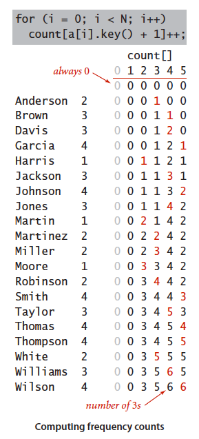
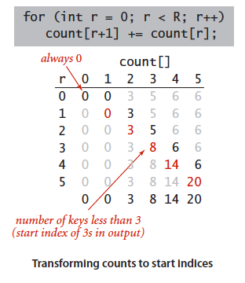
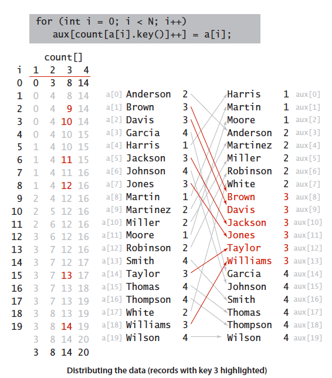
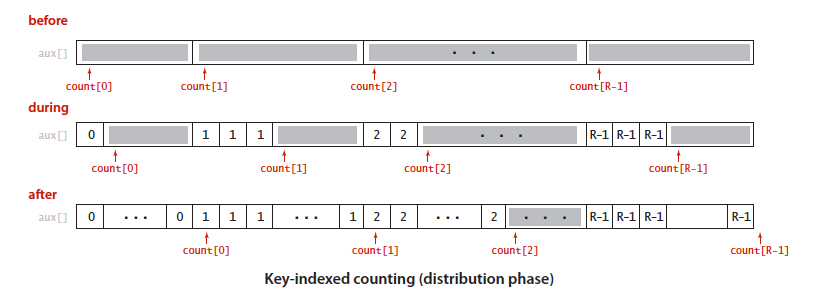
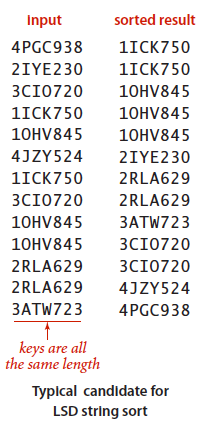
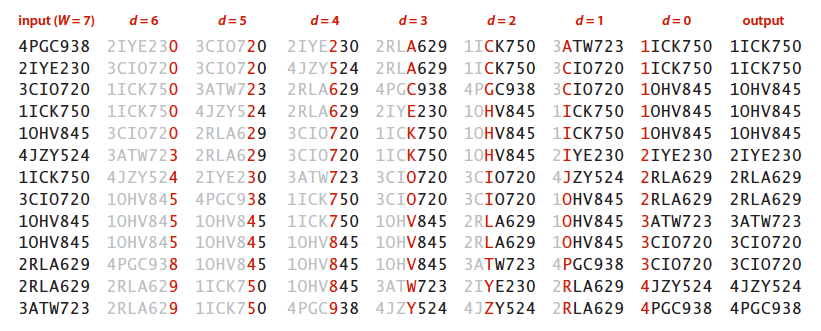
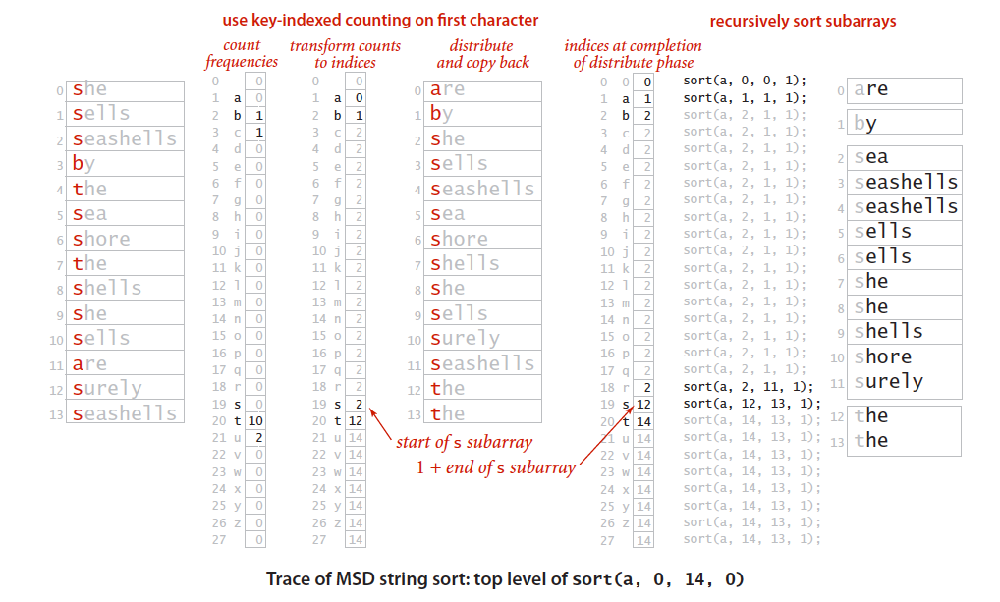

## 5.1 字符串排序

### 5.1.1 键索引计数法

大致分为四个部分：

1. **计算出现频率**

   选择可代表该字符串的一个 key ，按照这个 key 将字符串按某种顺序分组，计算各组中的字符串个数。

   例如：将字符串分为 0、1、2、3、4、5 个组 (key) ，最终完成之后数组 count[5] 中便存放有这五组类别中中字符串的个数。

   实现：(N为字符串个数)

   ```java
   for (int i = o; i < N; i++) {
       count[a[i].key() + 1] ++;
   }
   ```

   

2. **将频率转化为索引**

   按分组后每个没类别的个数计算出各个类别的起始索引。

   例如：第 0 组中有 5 个字符串，第 1 组中有 3 个字符串，可知第三组起始索引为 8 。

   实现：(R 位组个数)

   ```java
   for (int r = 0; r < R; r++) {
       count[r+1] = count[r]
   }
   ```

   

3. **将元素分类**

   将元素按类别顺序分类，即将属于相应类别的字符串放入到该类别起始索引到下一类别起始索引之间。

   例如：判断该字符串属于第 1 组，将其放入第一组起始位置处，**并将该组起始索引 +1**。

   实现：

   ```java
   for (int i = 0; i < N; i++) {
       aux[count[a[i].key()]++] = a[i];
   }
   ```

   

   

4. **回写**

   将排好序的字符串数组复制回原数组。

   ```java
   for (int i = 0; i < N; i++) {
       a[i] = aux[i];
   }
   ```

### 5.1.2 低位优先的字符串排序

以键索引计数法为基础，将字符串数组进行多次排序。

书中以将若干个车牌号字符串排序为例，已知代表车牌号的字符串长度相同为 W ，则只需将车牌号进行 W 次排序。



**键的选取：**即每次排序以何种手段将字符串分类，低位优先中的方法是将字符串左到右将每个字符看作 key 分类排序，以此方法每次排序将会有一共 R=256 个类别。

实现：

```java
public class LSD {
    public static void sort(String[] a, int w) {
        int N = a.length;
        int R = 256;
        String aux = new String[N];
        
        for (int d = w-1; d >= 0; d--) {
            // 根据第d个字符用键索引计数法排序
            int[] count = new int[R+1];
            for (int i = o; i < N; i++) { // 计算出现频率
                count[a[i].charAt(d) + 1] ++;
            }
            for (int r = 0; r < R; r++) { // 将频率转化为索引
                count[r+1] = count[r]
            }
            for (int i = 0; i < N; i++) { // 将元素分类
                aux[count[a[i].charAt(d)]++] = a[i];
            }
			for (int i = 0; i < N; i++) { //回写
                a[i] = aux[i];
            }
        }
    }
}
```

完整代码： [LSD.java](https://algs4.cs.princeton.edu/51radix/LSD.java.html)



### 5.1.3 高位优先的字符串排序

```java
public class MSD {
    private static final int BITS_PER_BYTE =   8;
    private static final int BITS_PER_INT  =  32;   // each Java int is 32 bits 
    private static final int R             = 256;   // extended ASCII alphabet size
    private static final int CUTOFF        =  15;   // cutoff to insertion sort

    // do not instantiate
    private MSD() { } 

    public static void sort(String[] a) {
        int n = a.length;
        String[] aux = new String[n];
        sort(a, 0, n-1, 0, aux);
    }

    // return dth character of s, -1 if d = length of string
    private static int charAt(String s, int d) {
        assert d >= 0 && d <= s.length();
        if (d == s.length()) return -1;
        return s.charAt(d);
    }

    // sort from a[lo] to a[hi], starting at the dth character
    private static void sort(String[] a, int lo, int hi, int d, String[] aux) {

        // cutoff to insertion sort for small subarrays
        if (hi <= lo + CUTOFF) {
            insertion(a, lo, hi, d);
            return;
        }

        // compute frequency counts
        int[] count = new int[R+2];
        for (int i = lo; i <= hi; i++) {
            int c = charAt(a[i], d);
            count[c+2]++;
        }

        // transform counts to indicies
        for (int r = 0; r < R+1; r++)
            count[r+1] += count[r];

        // distribute
        for (int i = lo; i <= hi; i++) {
            int c = charAt(a[i], d);
            aux[count[c+1]++] = a[i];
        }

        // copy back
        for (int i = lo; i <= hi; i++) 
            a[i] = aux[i - lo];


        // recursively sort for each character (excludes sentinel -1)
        for (int r = 0; r < R; r++)
            sort(a, lo + count[r], lo + count[r+1] - 1, d+1, aux);
    }

    public static void sort(int[] a) {
        int n = a.length;
        int[] aux = new int[n];
        sort(a, 0, n-1, 0, aux);
    }

    // MSD sort from a[lo] to a[hi], starting at the dth byte
    private static void sort(int[] a, int lo, int hi, int d, int[] aux) {

        // cutoff to insertion sort for small subarrays
        if (hi <= lo + CUTOFF) {
            insertion(a, lo, hi, d);
            return;
        }

        // compute frequency counts (need R = 256)
        int[] count = new int[R+1];
        int mask = R - 1;   // 0xFF;
        int shift = BITS_PER_INT - BITS_PER_BYTE*d - BITS_PER_BYTE;
        for (int i = lo; i <= hi; i++) {
            int c = (a[i] >> shift) & mask;
            count[c + 1]++;
        }

        // transform counts to indicies
        for (int r = 0; r < R; r++)
            count[r+1] += count[r];

/************* BUGGGY CODE.
        // for most significant byte, 0x80-0xFF comes before 0x00-0x7F
        if (d == 0) {
            int shift1 = count[R] - count[R/2];
            int shift2 = count[R/2];
            for (int r = 0; r < R/2; r++)
                count[r] += shift1;
            for (int r = R/2; r < R; r++)
                count[r] -= shift2;
        }
************************************/
        // distribute
        for (int i = lo; i <= hi; i++) {
            int c = (a[i] >> shift) & mask;
            aux[count[c]++] = a[i];
        }

        // copy back
        for (int i = lo; i <= hi; i++) 
            a[i] = aux[i - lo];

        // no more bits
        if (d == 4) return;

        // recursively sort for each character
        if (count[0] > 0)
            sort(a, lo, lo + count[0] - 1, d+1, aux);
        for (int r = 0; r < R; r++)
            if (count[r+1] > count[r])
                sort(a, lo + count[r], lo + count[r+1] - 1, d+1, aux);
    }
}

```

完整代码：[MSD.java](https://algs4.cs.princeton.edu/51radix/MSD.java.html)

