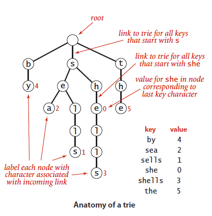
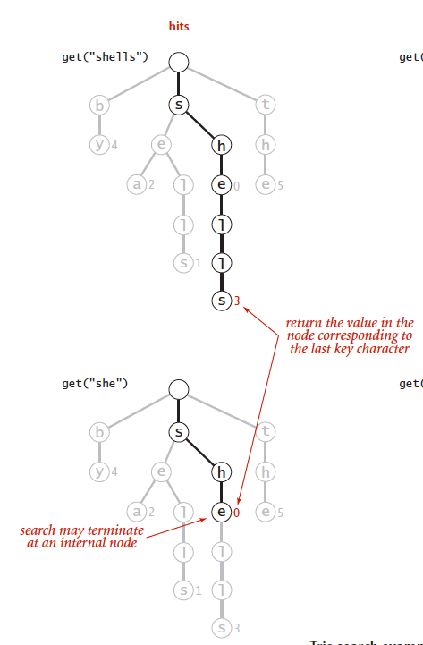
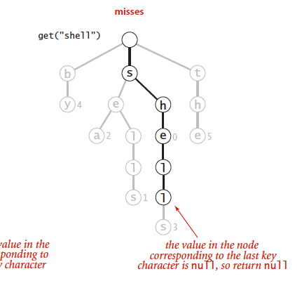
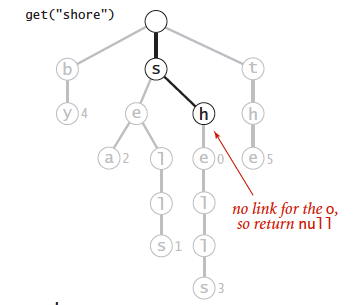
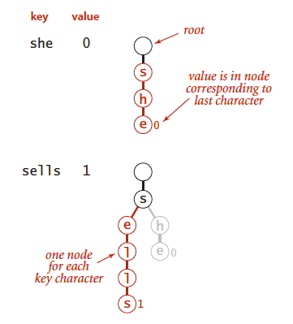
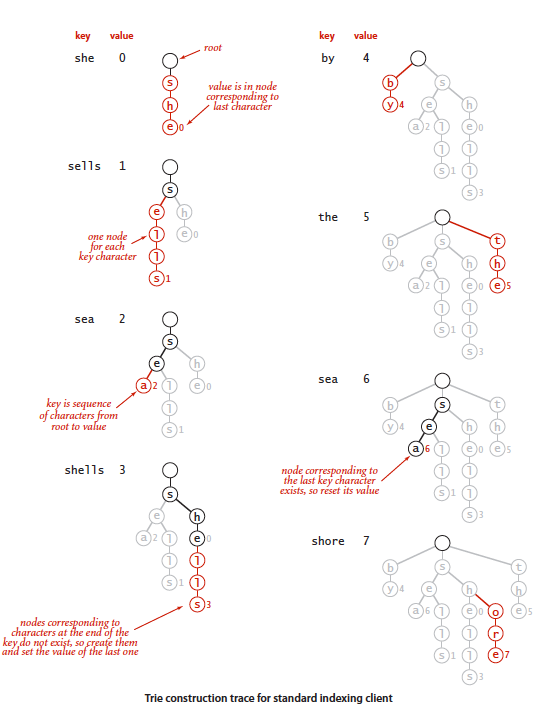

## 5.2 单词查找树

- 查找命中所需的时间与被查找的键的长度成正比；
- 查找未命中只需检查若干个字符。

### 5.2.1 单词查找树

单词查找树是由链接的结点所组成的数据结构，这些链接可能为空，也可能指向其他结点。每个结点都含有 R 条链接，其中 R 为字母表的大小（即字母表中字母的数量）。

**值为空的结点在符号表中没有对应的键，它们的存在是为了简化单词查找树中的查找操作。**

#### 5.2.1.2 查找操作

以被查找的字符为导向。单词查找树中每一个节点包含下一个可能出现的字符的链接，从根结点开始直至最后一个字母或者遇到空链接。

- 键的尾字符所对应的节点非空（一次命中）

  

- 键的尾字符所对应的节点为空（一次未命中）

  

- 查找结束于一条空链接（未命中）

  

#### 5.2.1.3 插入操作

与二叉查找树一样，插入前需要进行一次查找：

- 到达键的尾字符前遇到空链接。键不存在树中，需要为未被检查的每个字符创建节点

  

- 遇到空链接之前到达键的尾字符。将该节点的值设为键所对应的值（无论是否为空）。

  