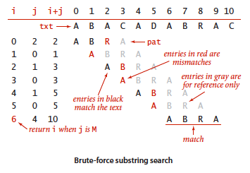
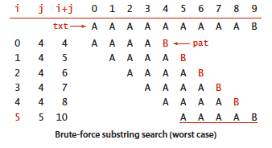
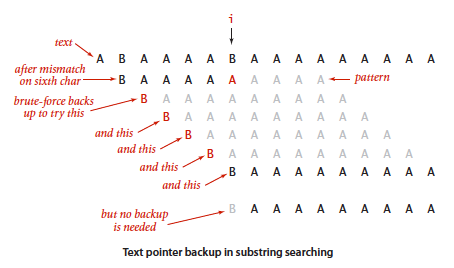

## 5.3 子字符串查找

- 问题描述：给定一段长度为 N 的文本和一个长度为 M 的**模式（pattern）**字符串，在文本中找到一个和该模式相符的子字符串。
- 限制：模式相对文本较短（M 可能等于 100 或者 1000），而文本相对模式很长（N 可能等于 100 万或者 10 亿）。

### 5.3.1 历史

### 5.3.2 暴力子字符串查找算法

在最坏情况下运行时间与 MN 成正比；但由于绝大多数比较在第一个字符时就会产生不匹配，实际运行时间一般与 M+N 成正比。

```java
public static int search(String pat, String txt) {
    int M = pat.length();
    int N = txt.length();
    for(int i = 0; i <= N-M; i++) {
        int j;
        for(j = 0; j < M; j++)
            if(txt.charAt(j+i) != pat.charAt(j))
                break;
        if(j == M)
            return i;    // 找到匹配
    }
    return N;    // 未找到匹配
}
```



**最坏的情况下：**



另一种实现：

```java
public static int search(String pat, String txt) {
    int M = pat.length();
    int N = txt.length();
    int i, j;
    for(i = 0, j = 0; i < N && j < M; i++) {
        if(txt.charAt(i) == pat.charAt(j))
            j++;
        else {
            i -= j;
            j = 0;
        }
    }
    if(j == M)
        return i - M;    // 找到匹配
    else
        return N;    // 未找到匹配
}
```

### 5.3.3 Knuth-Morris-Pratt(KMP) 子字符串查找算法



基本思想：在匹配失败之前，一部分文本的内容已经和模式相匹配。因此不该完全从头开始匹配。

设置：

- 文本指针 i，模式指针 j
- 数组 dfa[][]：记录匹配失败时模式指针 j 应该回退多远。

在查找中，`dfa[txt.charAt(i)][j]`是在比较了`txt.charAt(i)`和`pat.charAt(j)`之后应该和`txt.charAt(i+1)`比较的模式字符位置。

关于 KMP 算法，书中讲解的较麻烦且难以理解，推荐博文：https://www.cnblogs.com/yjiyjige/p/3263858.html

### 5.3.4 Boyer-Moore 字符串查找算法

### 5.3.5 Rabin-Karp 指纹字符串查找算法

